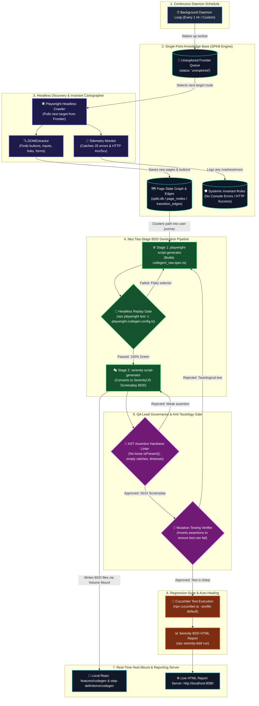

# NeoFlow Autonomous Quality Engine (AQE) - End-to-End Workflow Diagram

```mermaid
flowchart TD
    %% Styling
    classDef trigger fill:#1e293b,stroke:#3b82f6,stroke-width:2px,color:#fff
    classDef spkb fill:#0f172a,stroke:#10b981,stroke-width:2px,color:#fff
    classDef explorer fill:#1e1b4b,stroke:#818cf8,stroke-width:2px,color:#fff
    classDef neo fill:#14532d,stroke:#22c55e,stroke-width:2px,color:#fff
    classDef gate fill:#701a75,stroke:#e879f9,stroke-width:2px,color:#fff
    classDef regression fill:#7c2d12,stroke:#f97316,stroke-width:2px,color:#fff
    classDef output fill:#111827,stroke:#06b6d4,stroke-width:2px,color:#fff

    subgraph TRIGGER["1. Continuous Daemon Schedule"]
        CRON["⏰ Background Daemon Loop (Every 1 Hr / Custom)"]:::trigger
    end

    subgraph SPKB["2. Single Point Knowledge Base (SPKB Engine)"]
        FRONTIER[("🧭 Unexplored Frontier Queue<br/>(status: 'unexplored')")]:::spkb
        GRAPH_DB[("🗺️ Page State Graph & Edges<br/>(spkb.db / page_nodes / transition_edges)")]:::spkb
        INVARIANTS[("🛡️ Systemic Invariant Rules<br/>(No Console Errors / HTTP Success)")]:::spkb
    end

    subgraph DISCOVERY["3. Headless Discovery & Invariant Cartographer"]
        CRAWL["🕷️ Playwright Headless Crawler<br/>(Pulls next target from Frontier)"]:::explorer
        DOM_EXTRACT["🔍 DOMExtractor<br/>(Finds buttons, inputs, links, forms)"]:::explorer
        TELEMETRY["📡 Telemetry Monitor<br/>(Catches JS errors & HTTP 4xx/5xx)"]:::explorer
    end

    subgraph NEO_WORKFLOW["4. Neo Two-Stage BDD Generation Pipeline"]
        STAGE1["⚙️ Stage 1: playwright-script-generator<br/>(Builds codegen/<flow>_raw.spec.ts)"]:::neo
        REPLAY_GATE{"🚦 Headless Replay Gate<br/>(npx playwright test -c playwright.codegen.config.ts)"}:::neo
        STAGE2["🎭 Stage 2: serenity-script-generator<br/>(Converts to Serenity/JS Screenplay BDD)"]:::neo
    end

    subgraph QA_GOVERNANCE["5. QA Lead Governance & Anti-Tautology Gate"]
        AST_LINT{"🔎 AST Assertion Hardness Linter<br/>(No loose isPresent(), empty catches, timeouts)"}:::gate
        MUTATION_GATE{"🧬 Mutation Testing Verifier<br/>(Inverts assertions to ensure test can fail)"}:::gate
    end

    subgraph REGRESSION["6. Regression Suite & Auto-Healing"]
        CUCUMBER_RUN["🥒 Cucumber Test Execution<br/>(npx cucumber-js --profile default)"]:::regression
        SERENITY_REPORT["📊 Serenity BDD HTML Report<br/>(npx serenity-bdd run)"]:::regression
    end

    subgraph PERSISTENCE["7. Real-Time Host Mount & Reporting Server"]
        HOST_CODEGEN["📁 Local Repo: features/codegen & step-definitions/codegen"]:::output
        DOCKER_PORT["🌐 Live HTML Report Server: http://localhost:8080"]:::output
    end

    %% Execution Flow
    CRON -->|Wakes up worker| FRONTIER
    FRONTIER -->|Selects next target route| CRAWL
    CRAWL --> DOM_EXTRACT
    CRAWL --> TELEMETRY
    TELEMETRY -->|Logs any crashes/errors| INVARIANTS
    DOM_EXTRACT -->|Saves new pages & buttons| GRAPH_DB
    GRAPH_DB -->|Clusters path into user journey| STAGE1
    
    STAGE1 --> REPLAY_GATE
    REPLAY_GATE -->|Failed: Flaky selector| STAGE1
    REPLAY_GATE -->|Passed: 100% Green| STAGE2
    
    STAGE2 --> AST_LINT
    AST_LINT -->|Rejected: Weak assertion| STAGE2
    AST_LINT -->|Approved: Strict Screenplay| MUTATION_GATE
    
    MUTATION_GATE -->|Rejected: Tautological test| STAGE1
    MUTATION_GATE -->|Approved: Test is sharp| CUCUMBER_RUN

    CUCUMBER_RUN --> SERENITY_REPORT
    SERENITY_REPORT --> DOCKER_PORT
    STAGE2 -->|Writes BDD files via Volume Mount| HOST_CODEGEN
```
