# Autonomous Web Exploration & Continuous Regression Generation Plan

> **For agentic workers:** REQUIRED SUB-SKILL: Use `superpowers:subagent-driven-development` or `superpowers:executing-plans` to implement this plan task-by-task.

**Goal:** Build an autonomous multi-agent engine deployed on a compute instance (Docker/VM/K8s) that periodically crawls target websites, discovers interaction flows and state transitions, generates Playwright scripts, stabilizes them, and turns them into comprehensive Serenity/JS BDD regression suites.

**Architecture:** Distributed Multi-Agent State Machine combining:
1. **Site Crawler & Frontier Agent (Discovery)**: Builds sitemap, extracts interactive components (buttons, forms, links, navigation graphs), and tracks unexplored edges.
2. **Flow & Intent Synthesizer Agent (Cartographer)**: Groups interactions into business flows (Authentication, Checkout, Profile, Search, Form Submission).
3. **Playwright Script Generator Worker (`neo` Stage 1)**: Generates and auto-stabilizes raw `.spec.ts` files using headless replay gates.
4. **Serenity/JS BDD Converter Worker (`neo` Stage 2)**: Converts stabilized scripts into Gherkin `.feature` + Screenplay `.steps.ts` files while reusing `step-definitions/generic/`.
5. **Regression Orchestrator & PR Bot**: Executes regression runs, generates Serenity HTML reports, and raises PRs or commits new tests to Git.

**Tech Stack:** TypeScript / Node.js, Playwright, Serenity/JS, Cucumber.js, SQLite / DuckDB / GraphDB (for site exploration state), Docker, GitHub Actions / System Cron.

```mermaid
flowchart TD
    subgraph Periodic Trigger
        CRON[Cron Scheduler / Trigger API]
    end

    subgraph State & Knowledge Store
        SITE_GRAPH[(Site Topology & Flow Graph DB)]
        REGRESSION_REGISTRY[(Regression Test Registry)]
    end

    subgraph Agent Workforce
        EXPLORER[Agent 1: Site Explorer & UI Grapher]
        SYNTH[Agent 2: Flow Synthesizer & Deduplicator]
        STAGE1[Agent 3: Playwright Script Generator & Healer]
        STAGE2[Agent 4: Serenity/JS BDD Generator]
        RUNNER[Agent 5: Regression Runner & Reporter]
    end

    CRON --> EXPLORER
    EXPLORER <--> SITE_GRAPH
    EXPLORER --> SYNTH
    SYNTH --> STAGE1
    STAGE1 -->|Replay Gate Pass| STAGE2
    STAGE2 --> REGRESSION_REGISTRY
    REGRESSION_REGISTRY --> RUNNER
    RUNNER --> REPORT[Serenity BDD HTML Report & PR / Commit]
```



---

## User Review Required

> [!IMPORTANT]
> **Key Architectural Choices for Approval**:
> 1. **Persistence of Exploration Graph**: Should site navigation state (visited URLs, discovered buttons/forms, state transition graph) be kept in a local SQLite/DuckDB database or JSON artifacts in git?
> 2. **Continuous Deployment Target**: Standard Linux compute instance (e.g. AWS EC2, GCP Compute Engine, VPS) with Docker + Cron worker vs GitHub Actions Matrix workflow.
> 3. **Change Detection**: How should modified UI on the target site be handled (Auto-update existing steps vs Raise warning/PR diff)?

---

## Proposed System Architecture & Phased Implementation

### Phase 1: Exploration Engine & Flow Cartographer
Create an autonomous headless crawler module that analyzes target domains, extracts interactive elements, and produces structured Flow Blueprints.

#### Task 1.1: Core Site Explorer & DOM Mapper
- **Files:**
  - `src/explorer/crawler.ts`
  - `src/explorer/dom-extractor.ts`
  - `src/explorer/types.ts`
- **Responsibilities:**
  - Navigates pages with Playwright, evaluates interactive controls (inputs, dropdowns, buttons, anchors).
  - Normalizes selectors (ARIA labels, roles, IDs, text, test-ids).
  - Emits page state nodes and transition edges.

#### Task 1.2: Interaction Graph & Deduplication Storage
- **Files:**
  - `src/storage/graph-store.ts`
  - `src/storage/schema.sql`
- **Responsibilities:**
  - Stores visited paths, form field inputs, and navigation transitions.
  - Detects duplicate paths and updates "unexplored frontier" queue for subsequent agent sessions.

---

### Phase 2: Autonomous Flow Synthesis & `neo` Pipeline Automation
Automate the 2-stage `neo` workflow into programmatic worker APIs that can run headless on a server.

#### Task 2.1: Flow Synthesizer (Story Generator)
- **Files:**
  - `src/orchestrator/flow-synthesizer.ts`
- **Responsibilities:**
  - Analyzes graph transition paths (e.g. `Home -> Search -> Filter -> Product Page -> Cart`).
  - Synthesizes user scenarios and pass criteria in natural language + action sequence.

#### Task 2.2: Automated Neo Raw Replay Worker
- **Files:**
  - `src/workers/raw-generator-worker.ts`
- **Responsibilities:**
  - Generates `codegen/<flow_name>_raw.spec.ts`.
  - Runs headless verification: `npx playwright test -c playwright.codegen.config.ts codegen/<flow_name>_raw.spec.ts`.
  - Self-heals flaky locators if failed.

#### Task 2.3: Automated Serenity/JS BDD Generator Worker
- **Files:**
  - `src/workers/serenity-generator-worker.ts`
- **Responsibilities:**
  - Parses passing raw script.
  - Matches and reuses existing generic step definitions from `step-definitions/generic/`.
  - Emits `features/codegen/<flow_name>.feature` and `step-definitions/codegen/<flow_name>.steps.ts`.
  - Runs `npx cucumber-js --profile default --tags "@<flow_name>"` to confirm 100% green compilation and execution.

---

### Phase 3: Continuous Daemon / Compute Instance Orchestration
Package the system to run autonomously on any compute instance (Linux VM, Docker container, Kubernetes CronJob).

#### Task 3.1: Orchestration CLI & Cron Runner
- **Files:**
  - `src/cli/orchestrator.ts`
  - `Dockerfile`
  - `docker-compose.yml`
  - `scripts/run-periodic-exploration.sh`
- **Responsibilities:**
  - CLI command: `npx neoflow explore --target https://quickexamcreator.com --depth 3 --max-flows 5`
  - Docker container containing Playwright browsers, Node.js runtime, and Serenity BDD reporting tools.
  - Scheduled execution triggering exploration on new/updated routes.

#### Task 3.2: Git Automation & PR Creator
- **Files:**
  - `src/git/git-sync.ts`
- **Responsibilities:**
  - Automatically creates a branch `auto-regression/<flow-name>` or commits to `main`.
  - Automatically updates test suites, regenerates `target/site/serenity` HTML reports, and publishes test artifacts.

---

## Verification Plan

### Automated Tests
1. **Explorer Unit & Integration Tests**: Verify DOM extraction and graph mapping on mock pages.
2. **Neo Automation Pipeline Test**: End-to-end run on `https://quickexamcreator.com`:
   ```bash
   npm run explore -- --url https://quickexamcreator.com
   npx cucumber-js --profile default --tags "@regression"
   npm run test:report
   ```

### Manual Verification
- Inspect generated Serenity BDD HTML report in `target/site/serenity/index.html`.
- Confirm no broken or duplicate step definitions are generated.
