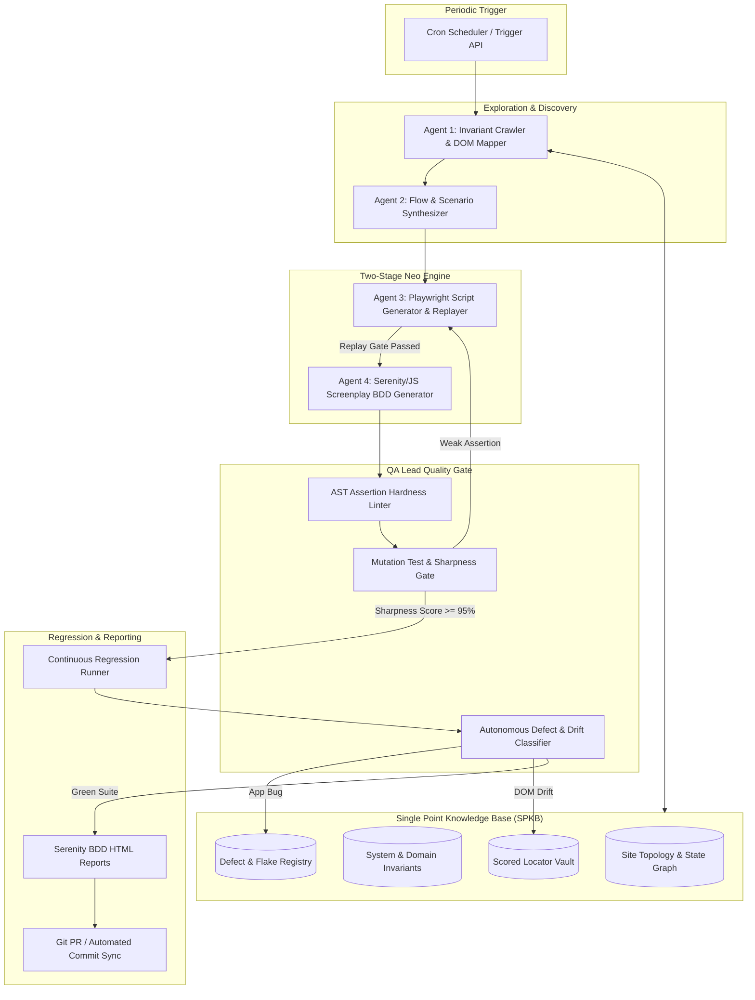

# Master Autonomous Quality Engine (AQE) Roadmap & Architecture Plan

> **For agentic workers:** REQUIRED SUB-SKILL: Use `superpowers:subagent-driven-development` or `superpowers:executing-plans` to implement this plan task-by-task. Steps use checkbox (`- [ ]`) syntax for tracking.

**Goal:** Build a production-ready, autonomous multi-agent quality engine deployed on a compute instance (Docker/VM/K8s) that periodically crawls any target website, maps application state transitions into a Single Point Knowledge Base (SPKB), generates and auto-heals Playwright & Serenity/JS Screenplay BDD tests, enforces zero-shortcut assertion integrity and mutation verification, and continuously expands regression test suites without human intervention.

**Architecture:** A distributed, state-driven multi-agent architecture combining:
1. **Single Point Knowledge Base (SPKB)**: Central graph database + invariant registry maintaining ground-truth business rules, domain entities, and locator health.
2. **Exploration & Invariant Agent (Frontier Cartographer)**: Headless Playwright crawler mapping DOM transitions, tracking network telemetry, and discovering edge cases.
3. **Neo Two-Stage Generation Pipeline**: Programmatic workers executing Stage 1 (`playwright-script-generator` with replay gate) and Stage 2 (`serenity-script-generator` with generic step reuse).
4. **QA Lead Governance & Mutation Gate**: AST validator rejecting weak assertions + Mutation Tester inverting checks to guarantee test sharpness.
5. **Autonomous Defect Classifier & Self-Healing Sync**: Triages failures into App Defects vs DOM Drift vs Flakiness, with automatic Git PR creation.

**Tech Stack:** TypeScript / Node.js, Playwright, Serenity/JS 3, Cucumber.js, SQLite / Kysely (SPKB Graph & Invariants), Docker, GitHub Actions / Linux Cron.



---

## Global Constraints & Zero-Tolerance Rules

1. **Zero-Shortcut Assertions**: No empty catch blocks, no loose `isPresent()` without state validation, no hardcoded `page.waitForTimeout()`, and no unbounded regexes (`/.*.*/`).
2. **Anti-Tautology Gate**: Every new test must undergo automated mutation testing (inverting assertions). If an inverted test passes against the target app, the test is rejected.
3. **Screenplay Pattern Standard**: All BDD step definitions must use `@serenity-js/core`, `@serenity-js/web`, `@serenity-js/assertions` with reusable generic steps preferred.
4. **Self-Contained Execution**: Fully containerized in Docker to run autonomously on any Linux compute instance with scheduled cron triggers.

---

## Detailed Task Breakdown

### Phase 1: Single Point Knowledge Base (SPKB) Core & Invariant Store

#### Task 1.1: SPKB Schema & Database Engine
**Files:**
- Create: `src/spkb/db.ts`
- Create: `src/spkb/schema.ts`
- Create: `src/spkb/types.ts`
- Test: `test/spkb/db.spec.ts`

**Interfaces:**
- Produces: `SPKBDb`, `PageNode`, `TransitionEdge`, `SystemInvariant`, `LocatorEntry`.

- [ ] **Step 1: Write failing tests for SPKB SQLite schema and repository methods**
- [ ] **Step 2: Run test to verify it fails (`npm test`)**
- [ ] **Step 3: Implement SQLite migration and repository methods (insertNode, insertEdge, registerInvariant, getUnexploredFrontier)**
- [ ] **Step 4: Run tests to verify they pass**
- [ ] **Step 5: Commit changes**

#### Task 1.2: System & Network Invariant Engine
**Files:**
- Create: `src/spkb/invariants-engine.ts`
- Modify: `support/serenity.config.ts`
- Test: `test/spkb/invariants-engine.spec.ts`

**Responsibilities:**
- Enforces invariant checks: Zero unhandled console errors, status codes $\in [200, 399]$, valid HTML structure.

---

### Phase 2: Autonomous Explorer & DOM Cartographer

#### Task 2.1: Headless Invariant Crawler
**Files:**
- Create: `src/explorer/crawler.ts`
- Create: `src/explorer/dom-extractor.ts`
- Create: `src/explorer/telemetry.ts`
- Test: `test/explorer/crawler.spec.ts`

**Responsibilities:**
- Traverses pages with Playwright, monitors network and console telemetry, extracts actionable controls (forms, buttons, inputs) with ARIA/Role-based locators, and updates SPKB graph.

#### Task 2.2: Flow Synthesizer (Story Generator)
**Files:**
- Create: `src/orchestrator/flow-synthesizer.ts`
- Test: `test/orchestrator/flow-synthesizer.spec.ts`

**Responsibilities:**
- Clusters graph transition paths into end-to-end user journeys (e.g. Navigation, Form submission, Search & Filter).

---

### Phase 3: Automated Neo 2-Stage Engine & QA Lead Gate

#### Task 3.1: Programmatic Stage 1 Raw Playwright Worker
**Files:**
- Create: `src/workers/raw-generator-worker.ts`
- Modify: `playwright.codegen.config.ts`
- Test: `test/workers/raw-generator.spec.ts`

**Responsibilities:**
- Generates `codegen/<name>_raw.spec.ts` and runs headless replay loop until 100% green.

#### Task 3.2: Programmatic Stage 2 Serenity Screenplay BDD Worker
**Files:**
- Create: `src/workers/serenity-generator-worker.ts`
- Modify: `step-definitions/generic/generic.steps.ts`
- Test: `test/workers/serenity-generator.spec.ts`

**Responsibilities:**
- Converts raw scripts to `features/codegen/<name>.feature` and `step-definitions/codegen/<name>.steps.ts` with generic step reuse.

#### Task 3.3: AST Assertion Hardness Linter & Mutation Test Verifier
**Files:**
- Create: `src/auditor/ast-linter.ts`
- Create: `src/auditor/mutation-verifier.ts`
- Test: `test/auditor/mutation-verifier.spec.ts`

**Responsibilities:**
- Lints code for forbidden shortcuts (empty catch blocks, loose existence checks).
- Inverts assertions and runs against target to verify the test fails (sharpness gate).

---

### Phase 4: Compute Deployment & Continuous Execution Daemon

#### Task 4.1: CLI Orchestrator & Autonomous Daemon
**Files:**
- Create: `src/cli/neoflow.ts`
- Create: `scripts/daemon-runner.sh`
- Create: `Dockerfile`
- Create: `docker-compose.yml`

**Responsibilities:**
- Provides CLI `npx neoflow explore --url <target> --depth <n>` and background cron daemon for compute instances.

#### Task 4.2: Automated Defect Triage & Git PR Sync
**Files:**
- Create: `src/git/git-sync.ts`
- Create: `src/triage/defect-classifier.ts`
- Create: `.github/workflows/continuous-qa.yml`

**Responsibilities:**
- Classifies failures into App Bug vs DOM Drift vs Flakiness.
- Creates Git branches, auto-generates Serenity HTML reports, and raises PRs for newly minted regression tests.

---

## Verification & Acceptance Plan

### 1. Automated Unit & Integration Tests
- Verify SPKB graph persistence, invariant detection, AST assertion linter, and mutation validator across test suites.

### 2. End-to-End Live Validation on Target Sites
- Execute on `https://quickexamcreator.com`:
  ```bash
  npm run neoflow -- --url https://quickexamcreator.com --depth 2
  ```
- Verify:
  - Discovered paths stored in SPKB.
  - Passing raw and Serenity BDD tests generated.
  - Mutation testing passes with 0 tautological tests.
  - Serenity HTML report generated in `target/site/serenity/index.html`.
