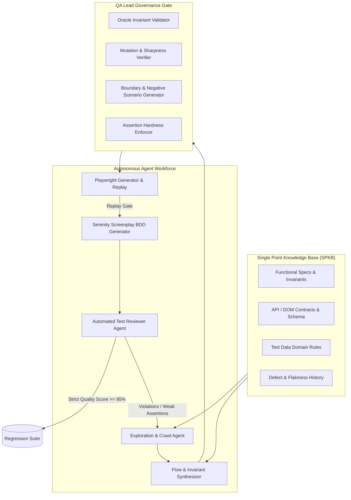
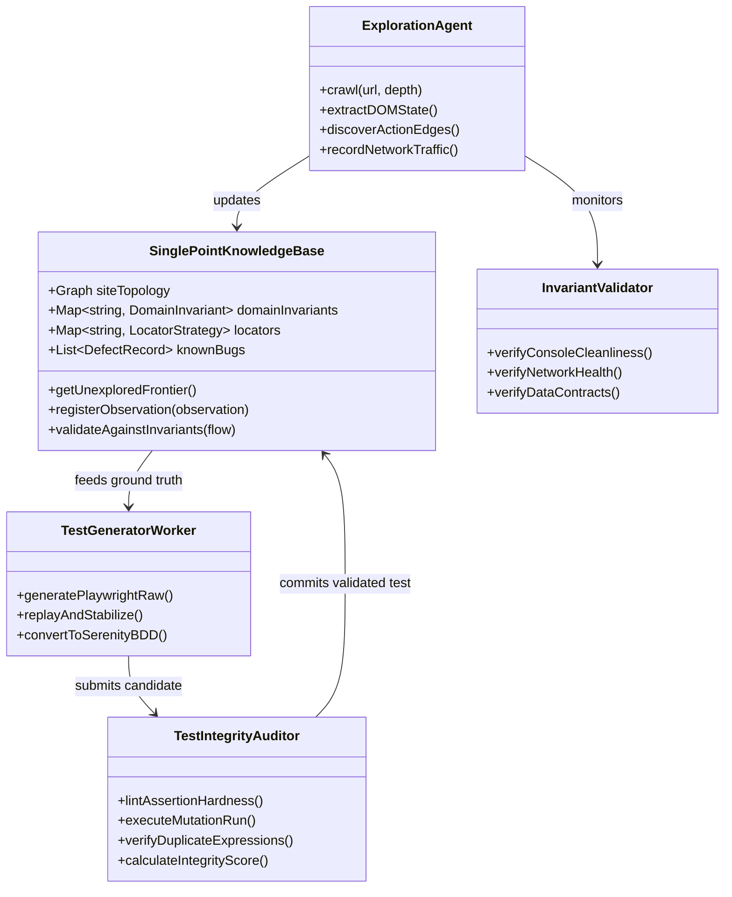

# Test Lead & Automation Architect Blueprint: Autonomous Quality Engine & Knowledge Base

> **Role Perspective:** QA Lead (Governance, Test Integrity, Oracle Problem, Defect Discovery) + Automation Architect (Distributed Agents, Knowledge Graph, Screenplay Pattern, Flakiness Immunity).

---

## 1. Executive Summary & Core Philosophies

In fully autonomous test generation without human-in-the-loop approvals, the greatest risk is **"The Oracle Problem" and "Tautological Testing"** — where an agent discovers whatever the UI currently does, writes assertions that match the current buggy behavior, and artificially claims 100% green builds.

To build an enterprise-grade autonomous QA system, we must enforce:
1. **Single Point Knowledge Base (SPKB)**: Ground truth requirements, business rules, invariants, and data contracts that the agent must test *against* rather than merely mirroring runtime DOM snapshots.
2. **Zero-Shortcut Assertion Integrity ("Fail Fast, Fail Honest")**: Forbidding loose assertions (`isPresent()`, `true === true`, broad regex catch-alls, ignoring HTTP 4xx/5xx or console errors).
3. **Anti-Tautology & Mutation Verification**: Validating test sharpness by deliberately mutating assertions or mock states to ensure the test *can and will fail* if a real regression occurs.
4. **Autonomous Defect Classification**: Distinguishing between **Application Bugs**, **Breaking UI/Schema Changes**, and **Environmental Flakiness** without human intervention.



---

## 2. Core Testing Principles (Test Lead Deep Dive)

### Principle 1: The Oracle & Single Point Knowledge Base (SPKB)
- **Problem**: If an agent visits a page showing an error boundary or broken price calculation and simply asserts `expect(page.getByText("Error loading data")).toBeVisible()`, the test is tautological and useless.
- **Solution**: The **SPKB** maintains:
  - **Global Invariants**:
    - Zero unhandled console errors / uncaught JavaScript exceptions.
    - Zero unexpected HTTP 4xx/5xx network responses on key transactions.
    - DPDP / Accessibility / Core Web Vitals minimum baseline thresholds.
    - Navigation state transitions must alter URL and render designated container elements.
  - **Entity & Domain Invariants**:
    - E.g., `ProductPrice > 0`, `Total == Sum(Items) + Tax - Discount`, `Email regex validation`, `Mandatory field indications`.
  - **Storage Architecture**: Graph database (e.g. SQLite + JSON-LD / GraphML) storing page nodes, action transitions, expected data contracts, and historical flakiness scores.

### Principle 2: Zero-Shortcut & Strict Assertion Policy
Agents must adhere to strict linting and AST analysis rules before any test is approved:

| Forbidden Agent Shortcut (Anti-Pattern) | Enforced Quality Standard |
| :--- | :--- |
| **Loose existence check**: `Ensure.that(el, isPresent())` | **State & Value Verification**: Must check visibility, enabled state, and exact/normalized text or attribute values (`isVisible()`, `equals(...)`). |
| **Unbounded / Overly broad regex**: `toHaveURL(/.*.*/)` | **Strict Path & Parameter Match**: Exact pathname, specific query params, and canonical route matching. |
| **Silent Catch Blocks / Ignored Timeouts**: `try { click() } catch {}` | **Strict Failure Propagation**: Uncaught errors must fail the test immediately; optional UI states must use explicit conditional branching logic in Screenplay tasks. |
| **Hardcoded Sleeps**: `page.waitForTimeout(5000)` | **Event-driven synchronization**: `Ensure.eventually(...)`, `waitForResponse()`, `waitForLoadState('networkidle')`. |
| **Superficial Happy Path Only**: Testing only valid forms. | **Mandatory Negative & Boundary Testing**: Required invalid inputs, edge-case strings, empty states, and unauthorized access attempts. |

### Principle 3: Mutation Testing for Test Sharpness (Anti-Tautology Gate)
Before admitting any generated test into the regression suite:
1. The **Audit Agent** runs a *Mutation Check*:
   - Invert an assertion (e.g., change `equals("Vatra Assess")` to `equals("NonExistentText")`).
   - Run the test against the live/mock environment.
   - **Pass Criterion**: The test **MUST FAIL**. If an inverted test passes, the test is discarded as a "vague / ineffective assertion".

### Principle 4: Defect Triage & Categorization Engine
When an autonomous test run fails during continuous execution, the system classifies the failure into 3 distinct buckets:
1. **Defect (App Regression)**: Assertion failed on a previously green invariant (e.g., button returned 500, price mismatch). Creates a formal GitHub Issue / Jira defect ticket with traces and Serenity report.
2. **Contract / DOM Evolution**: Selector changed but business intent remains (e.g., CSS class renaming, redesign). Triggers the Healing Worker to update the locator mapping while preserving business assertions.
3. **Infrastructure Flakiness**: Network timeout, browser crash. Re-queued for retry in an isolated session with trace inspection.

---

## 3. Autonomous System Architecture (Architect Deep Dive)



### Component Breakdown

#### 1. SPKB Engine (`src/knowledge-base/`)
- **`graph-engine.ts`**: Maintains directed graph of application states ($S_0 \xrightarrow{\text{click}} S_1 \xrightarrow{\text{fill}} S_2$).
- **`invariants-registry.ts`**: Defines systemic rules (e.g. status codes $\in [200, 399]$, zero uncaught exceptions, valid heading hierarchies, form submission success confirmations).
- **`locator-vault.ts`**: Centralized, scored locators ranked by stability (Role > TestID > Aria > CSS Path).

#### 2. Discovery & Invariant Exploration Worker (`src/explorer/`)
- Headless Playwright crawler with event listeners for `console`, `pageerror`, `requestfailed`, `response`.
- Emits structured telemetry alongside DOM snapshots.

#### 3. Stage 1 & 2 Neo Autonomous Pipeline (`src/workers/`)
- **Stage 1**: Playwright raw generator with headless loop checking against `playwright.codegen.config.ts`.
- **Stage 2**: Serenity/JS Screenplay generator adhering to:
  - `@serenity-js/core`, `@serenity-js/web`, `@serenity-js/assertions`.
  - Reusing generic steps in `step-definitions/generic/`.

#### 4. Automated Test Auditor & Mutation Gate (`src/auditor/`)
- **AST Inspector**: Blocks `any`, empty catches, raw timeouts, and weak assertions.
- **Mutation Runner**: Automatically flips assertions and confirms failure before approving test.

#### 5. Headless Compute Runner & PR Sync (`src/runner/`)
- Packaged as a lightweight Docker container.
- Runs scheduled cron jobs on EC2 / GCP Compute / VPS.
- Generates Serenity BDD HTML reports in `target/site/serenity` and creates Git commits / PRs.

---

## 4. Phased Implementation Roadmap

### Phase 1: Knowledge Base Core & Invariant Engine
- Build `src/knowledge-base/` (Graph storage, Invariant definitions, Telemetry monitors).
- Add network & console integrity assertions into the generic step definitions.

### Phase 2: Autonomous Explorer & Mutation Verifier
- Build crawler with automatic state & edge discovery.
- Implement AST validator and Mutation Gate to block weak/shortcut tests.

### Phase 3: Autonomous Pipeline Integration
- Wire exploration -> invariant validation -> Stage 1 raw generation -> Stage 2 Serenity BDD generation -> Mutation check.

### Phase 4: Containerization & Continuous Compute Orchestration
- Build Dockerfile with Playwright browsers & Serenity CLI.
- Add cron orchestration script and Git PR automation.

---

## 5. Verification Plan

1. **Assertion Sharpness Verification**: Run mutation tests against intentional regressions on `quickexamcreator.com` to guarantee 100% detection rate.
2. **Zero False Positive Gate**: Ensure suite passes consistently on clean builds without flake.
3. **End-to-End Autonomous Run**:
   ```bash
   npx neoflow-engine --target https://quickexamcreator.com --depth 2 --strict-invariants
   ```
