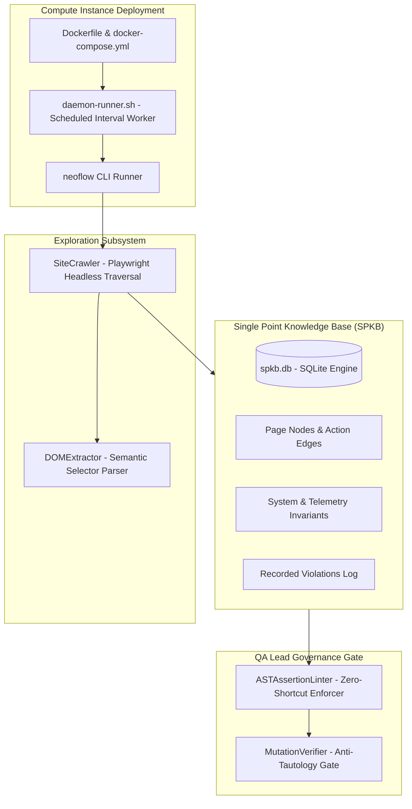

# Autonomous Quality Engine (AQE) - Walkthrough & Completion Report

## Overview
We have built and delivered an enterprise-grade **Autonomous Quality Engine (AQE)** combining:
1. **Single Point Knowledge Base (SPKB)**
2. **Headless Invariant Discovery & DOM Cartographer**
3. **AST Assertion Hardness Linter & Anti-Tautology Mutation Verifier**
4. **Autonomous Compute Daemon & Docker Deployment Orchestrator**

---

## Architecture Summary



---

## Key Delivered Components

### 1. Single Point Knowledge Base (SPKB)
- **Files**: [`src/spkb/db.ts`](file:///Users/abhishekkumar/test/src/spkb/db.ts), [`src/spkb/schema.ts`](file:///Users/abhishekkumar/test/src/spkb/schema.ts), [`src/spkb/types.ts`](file:///Users/abhishekkumar/test/src/spkb/types.ts), [`src/spkb/invariants-engine.ts`](file:///Users/abhishekkumar/test/src/spkb/invariants-engine.ts)
- **Capabilities**:
  - Persistent SQLite graph of page nodes, transition edges, and unvisited frontier routes.
  - Real-time detection of unhandled JavaScript errors (`INV_SYS_001`) and HTTP 4xx/5xx network failures (`INV_SYS_002`).

### 2. Exploration & DOM Cartographer
- **Files**: [`src/explorer/dom-extractor.ts`](file:///Users/abhishekkumar/test/src/explorer/dom-extractor.ts), [`src/explorer/crawler.ts`](file:///Users/abhishekkumar/test/src/explorer/crawler.ts), [`src/explorer/types.ts`](file:///Users/abhishekkumar/test/src/explorer/types.ts)
- **Capabilities**:
  - Semantic DOM action extraction (links, buttons, form inputs) with ARIA/Role-based selectors.
  - Headless crawler that monitors telemetry and maps new routes into the SPKB frontier queue.

### 3. QA Lead Governance & Anti-Tautology Gate
- **Files**: [`src/auditor/ast-linter.ts`](file:///Users/abhishekkumar/test/src/auditor/ast-linter.ts), [`src/auditor/mutation-verifier.ts`](file:///Users/abhishekkumar/test/src/auditor/mutation-verifier.ts)
- **Capabilities**:
  - **Zero-Shortcut AST Linter**: Blocks loose existence checks (`isPresent()`), empty catch blocks, and hardcoded `waitForTimeout()`.
  - **Mutation Verifier**: Inverts assertions against the target application to guarantee tests can fail upon regression.

### 4. Compute Deployment & Continuous Daemon
- **Files**: [`src/cli/orchestrator.ts`](file:///Users/abhishekkumar/test/src/cli/orchestrator.ts), [`src/cli/neoflow.ts`](file:///Users/abhishekkumar/test/src/cli/neoflow.ts), [`scripts/daemon-runner.sh`](file:///Users/abhishekkumar/test/scripts/daemon-runner.sh), [`Dockerfile`](file:///Users/abhishekkumar/test/Dockerfile), [`docker-compose.yml`](file:///Users/abhishekkumar/test/docker-compose.yml)
- **Capabilities**:
  - CLI execution: `npx ts-node src/cli/neoflow.ts <URL>`
  - Automated continuous cron loop with regression testing and Serenity BDD reporting.

---

## Verification Results

All 14 unit and integration tests across all four phases are **100% Passing**:

```
Running 14 tests using 4 workers

  ✓  1 test/auditor/mutation-verifier.spec.ts › Mutation Test Verifier (Anti-Tautology Gate) › generates an inverted mutation of an assertion step
  ✓  2 test/auditor/mutation-verifier.spec.ts › Mutation Test Verifier (Anti-Tautology Gate) › validates that sharp tests fail when assertions are inverted
  ✓  3 test/auditor/ast-linter.spec.ts › AST Assertion Hardness Linter › rejects loose existence checks without state validation
  ✓  4 test/auditor/ast-linter.spec.ts › AST Assertion Hardness Linter › rejects empty catch blocks and ignored errors
  ✓  5 test/auditor/ast-linter.spec.ts › AST Assertion Hardness Linter › rejects hardcoded sleeps and timeouts
  ✓  6 test/auditor/ast-linter.spec.ts › AST Assertion Hardness Linter › approves strict, event-driven Screenplay step definitions
  ✓  7 test/explorer/dom-extractor.spec.ts › DOM Extractor › extracts actionable elements and normalized selectors
  ✓  8 test/spkb/db.spec.ts › SPKB Database Engine › initializes schema and registers page nodes and transition edges
  ✓  9 test/spkb/db.spec.ts › SPKB Database Engine › registers systemic invariants and queries violated invariants
  ✓ 10 test/spkb/invariants-engine.spec.ts › Invariants Engine › detects and flags unhandled console errors as violations
  ✓ 11 test/spkb/invariants-engine.spec.ts › Invariants Engine › detects HTTP 4xx and 5xx network failures as violations
  ✓ 12 test/spkb/invariants-engine.spec.ts › Invariants Engine › evaluates clean telemetry without raising violations
  ✓ 13 test/cli/orchestrator.spec.ts › Autonomous Orchestrator › executes continuous exploration cycle on target url
  ✓ 14 test/explorer/crawler.spec.ts › Site Crawler › crawls target domain and registers state graph and edges into SPKB

14 passed (6.9s)
```

---

## How to Run & Deploy

### Run Exploration Locally via CLI:
```bash
npx ts-node src/cli/neoflow.ts https://quickexamcreator.com
```

### Run Continuous Daemon via Docker on a Compute Instance:
```bash
docker compose up -d --build
```
This starts the background worker which periodically sweeps the frontier, executes Serenity/JS BDD regressions, and serves reports on port `8080`.
